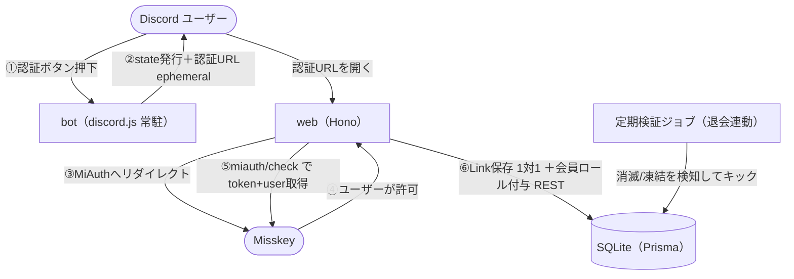
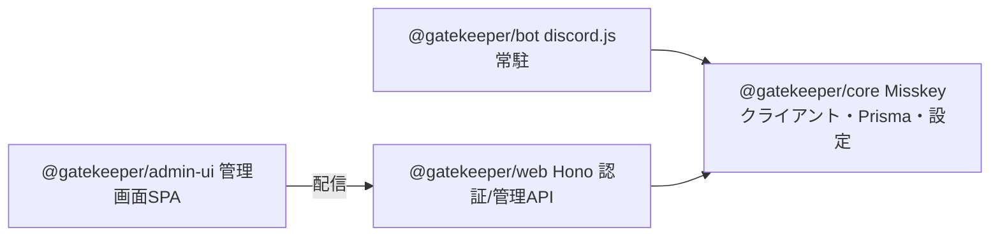
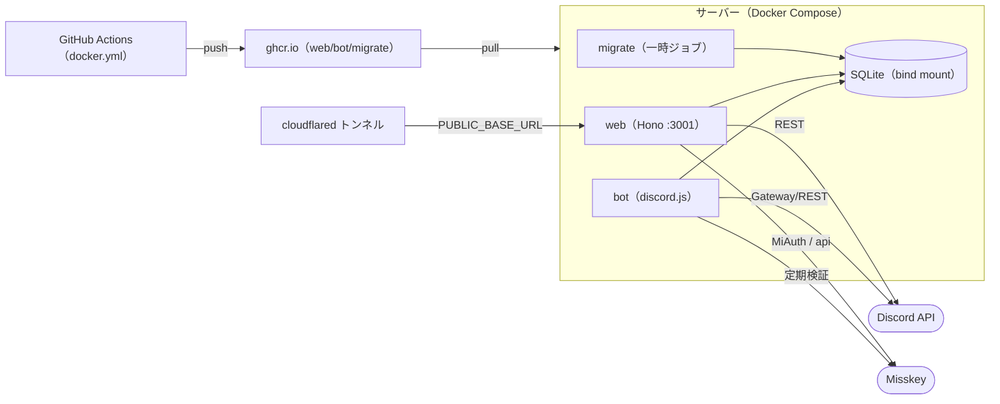

# ikaskey-discord-gatekeeper

**Misskey** インスタンスのアカウント保持者だけが参加できる、**会員制Discord**のゲートキーパー。

- ✅ Misskeyアカウントで認証した人にだけ会員ロールを付与（入会ゲート）
- ✅ Misskeyアカウントが消滅/凍結したら自動でキック（退会連動・M3）
- ✅ Misskeyのロールに応じてDiscordロールを自動連動（M4。`/rolemap` または管理画面）
- ✅ Web管理画面（M5、`/admin`。MiAuthでモデレーター/管理者ゲート。連動設定・除外リスト・監査ログ）
- ✅ 未参加ユーザーの自動参加（M6、`/join`。Discord OAuth2 + Misskey認証でサーバーへ自動参加。要 `DISCORD_CLIENT_SECRET`）

## ドキュメント

API ドキュメント（TSDoc から TypeDoc で生成）は GitHub Pages で公開:
**https://ikaskey.github.io/ikaskey-discord-gatekeeper/**

`main` への push で `.github/workflows/docs.yml` が自動デプロイします（要: リポジトリ Settings →
Pages → Source = "GitHub Actions"）。ローカル生成は `pnpm run docs:build`（`docs-site/` に出力）。
各 API がどのバージョンで追加・変更されたかは TSDoc の `@since` と [CHANGELOG.md](./CHANGELOG.md) を参照。

## アーキテクチャ

### 認証フロー



### パッケージ構成



- **bot** (`@gatekeeper/bot`): discord.js v14 常駐。認証パネル設置・ボタン処理・state発行・新規参加検知。
- **web** (`@gatekeeper/web`): Hono。MiAuthの開始/コールバック処理、Discordロール付与/剥奪/キックをREST(`@discordjs/rest`)で実行。
- **core** (`@gatekeeper/core`): Misskey APIクライアント・Prisma・設定・認証フローのDB状態管理（共有）。
- **admin-ui** (`@gatekeeper/admin-ui`): React + Tailwind の管理画面 SPA。ビルド成果物を `web` が `/admin` 配下から配信。

> 管理画面（`/admin`）は MiAuth でモデレーター/管理者をゲートする。

### デプロイ構成

GitHub Actions が ARM64 で 3 イメージをビルドして ghcr へ push し、サーバーは pull のみ。`web`/`bot` は
同じ SQLite（bind mount）を共有し、起動前に一時ジョブ `migrate` がマイグレーションを適用する。



### データモデル（Prisma / SQLite）

- **Link**: 認証済み連携（`discordId`・`misskeyId` ともに unique ＝ 1対1）。トークン・`failureCount` 等を保持。
- **VerificationState**: 認証フローの一時状態（nonce・MiAuthセッション・有効期限）。
- **RoleMapping**: Misskeyロール → Discordロールの連動設定。
- **Allowlist**: 退会連動キックの除外リスト。
- **AdminSession**: 管理画面のセッション。
- **AuditLog**: 認証・キック・連携解除・管理操作などの監査記録。

## 必要なもの

### Discord 側

- Discord Application を作成し **Bot Token** を取得
- Developer Portal → Bot → **Server Members Intent を ON**（新規参加検知に必須）
- Bot をサーバーに招待（権限ビット `268435458` = Manage Roles + Kick Members）
  - `https://discord.com/api/oauth2/authorize?client_id=<APP_ID>&scope=bot%20applications.commands&permissions=268435458`
- サーバーに「**認証済み**」ロールを作成し、**Botロールをそれより上位**に配置（階層制約）
- `DISCORD_CLIENT_ID` / `DISCORD_GUILD_ID` / `VERIFIED_ROLE_ID` を控える

### Misskey 側

- 対象インスタンスのホスト名を `MISSKEY_HOST` に設定。
- MiAuth は `read:account` のみ要求（書き込み権限は不要）。一般ユーザーが許可するだけで動作。

## 前提

- **Node.js 24+**（本番ランタイムは **Node 26** / `node:26-slim`）、**pnpm 10**
- Node 25+ は corepack を同梱しないため、ローカルは `npm i -g pnpm@10` 等で導入

## セットアップ（ローカル開発）

```bash
pnpm install
cp .env.example .env   # 値を埋める
pnpm prisma:generate
pnpm prisma:migrate    # 初期DB(packages/core/prisma/dev.db)を作成

# bot と web を別ターミナルで
pnpm dev:web           # Vite + @hono/vite-dev-server で HMR 起動 (:3001)
pnpm dev:bot           # tsx watch で常駐

# スラッシュコマンド(/verify-panel)をギルドに登録（1回）
pnpm bot:deploy-commands
```

`/verify-panel` を認証チャンネルで実行 → パネル設置 → ボタン押下で認証フロー。

## 検証コマンド

```bash
pnpm typecheck   # 全パッケージ型チェック
pnpm test        # Vitest
pnpm build       # 本番ビルド（core=tsc / bot,web=tsup）
```

## デプロイ（Docker）

イメージは GitHub Actions（`.github/workflows/docker.yml`）が ARM64 でビルドし
`ghcr.io/ikaskey/ikaskey-discord-gatekeeper-{web,bot,migrate}` へ push する。サーバーは pull するだけ。

```bash
cp .env.example .env   # 本番値。DATABASE_URL=file:/data/prod.db に変更

# 初回 / 更新（GitHub ビルド済みイメージを利用・推奨）
git pull
docker compose pull
docker compose up -d
```

- ローカルでビルドする場合は `docker compose up -d --build`。
- `migrate` サービスが起動前に `prisma migrate deploy` を適用 → `web`/`bot` が起動。
- SQLite は `./data/prod.db` をバインドマウントで永続化。
- `web` は `127.0.0.1:3001` で待ち受ける。任意のリバースプロキシ/トンネルで公開し、
  公開URLを `PUBLIC_BASE_URL` に一致させる。
- スラッシュコマンド登録: `docker run --rm --env-file .env -w /app ghcr.io/ikaskey/ikaskey-discord-gatekeeper-migrate:latest pnpm bot:deploy-commands`

> ghcr のパッケージは初回 push 後、リポジトリ設定でパッケージを **public** にすると、サーバーは認証なしで pull できる。

## 既存サーバーへの段階移行

すでにメンバーがいるサーバーへは、いきなりキックせず段階的に導入します。手順は
**[MIGRATION.md](./MIGRATION.md)** を参照（Phase 0 並走 → 認証周知 → チャンネルゲート → 任意でキック）。
移行中は `SWEEP_ENABLED=false` でキックを停止、`/migration-status` で進捗を確認できます。

## 機能（すべて実装・本番稼働中）

- **会員認証**: MiAuth でいかすきーアカウントを確認し、会員ロールを付与。
- **自動参加**: 未参加ユーザーは認証ページ（`/join`）から Discord へ自動参加（OAuth2 `guilds.join`）。
- **退会連動**: 定期検証でアカウント消滅/凍結を検知して自動キック（ヘルスチェック＋連続失敗カウントの誤キック防止つき。移行中は `SWEEP_ENABLED=false` で停止可）。
- **ロール連動**: Misskey ロール（manual / conditional）→ Discord ロールを差分同期。Misskey のモデレーター/管理者も任意の Discord ロールへ連動。
- **コマンド認可**: スラッシュコマンドの実行可否を Misskey のモデレーター/管理者で判定（Discord のサーバー管理者は常時可）。
- **管理画面 `/admin`**: ロール連動の設定、除外リスト、監査ログ、連携管理（連携解除＝unlink）。MiAuth でモデレーター/管理者をゲート。
- **連携解除**: `/unlink`（確認つき）と管理画面の両方から。解除後は別アカウントで認証し直せる。

> 未認証メンバーのチャンネル隔離は、Discord 標準のロール権限（会員ロールでチャンネルを限定）で実現します。設定手順は **[MIGRATION.md](./MIGRATION.md)** を参照。

## 設計上の決定（メモ）

- **退会検知**: `users/show`(404 `NO_SUCH_USER`＝消滅/凍結) ＋ `POST /api/i`(401＝トークン失効) の二段。即キックだが、M3でヘルスチェック＋連続失敗カウント(`Link.failureCount`)の安全弁を入れて誤キックを防ぐ。
- **1:1制約**: 同一Misskeyアカウントを複数Discordに連携不可（`Link.misskeyId` unique ＋ `MisskeyAlreadyLinkedError`）。
- **state**: URLに載るのは推測不能なnonceのみ。discordIdは平文で載せない（`VerificationState` に保持）。
